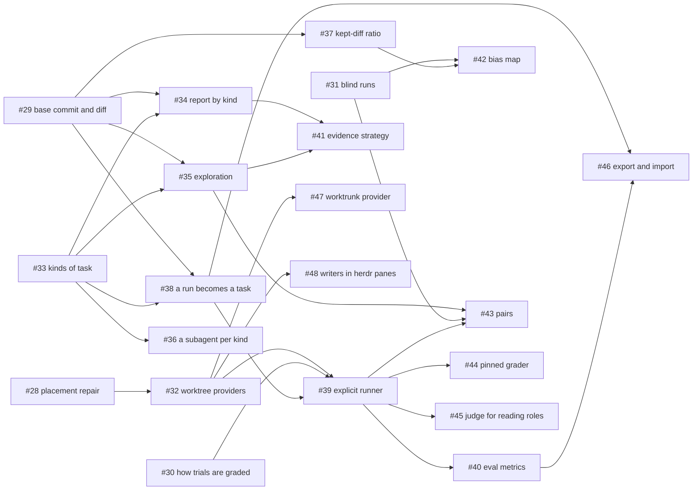

# Plugins and evals — the design

> Worked out on 2026-10-02 and 2026-10-03. Nothing here is built. The
> plan is the board, [cahoots](https://github.com/users/avihut/projects/3),
> issues #27 to #48. **Each ticket is the spec of its part, and this
> document is the reasoning behind them.** Where the two differ, the ticket
> wins. Wherever this document describes today's code, it means the code at
> `150f6b9`.

Two ideas meet here. The first is to make parts of cahoots pluggable: how a
writer's worktree is cut, how a target is chosen, and how a target is driven.
The second is to give cahoots evals, so that the choice of model for a kind
of task rests on evidence from the person's own work. They meet because
evals need the picker to have more than one strategy, and graders and
metrics to come in more than one kind.

## What "plugin" means here

**A plugin is a closed seam, compiled in, and chosen by a person's
setting.** That is how harnesses and meters already work. `trait Harness`
has one implementation per `HarnessId`, and `harness::harness` matches on
the id (`src/harness/mod.rs`). The usage meters are a closed set too, and
`[meter] use` in config.toml picks one (`src/meter`). A new strategy is a
new variant, reviewed like any other code.

There are no plugins loaded at run time, of any kind: no dynamic library,
no script, and no outside program that takes over a decision cahoots makes
on an agent's path. The usage meter is the one outside program on that
path, and it is a known tool at a path a person pinned, with a fixed
protocol and a refusal for every answer cahoots does not understand. The
hard rules say why there are no others.

- **Rule 3:** commands are argv arrays built in code from typed values, in
  `src/spawn`. If a plugin could name a command, a file would be choosing
  what runs outside the sandbox.
- **Rule 6:** data never widens authority. A plugin is data that runs.
- **Rule 9:** the dependency list is closed, and a plugin loader opens it.

**No flag that an agent can pass changes a fence.** The setting that picks
a strategy lives in config.toml. A person changes it with `cahoots settings`,
or with `settings set`. An agent-tier flag may select among things a person
wrote, such as a kind of task by name (#33). It never selects a tool, a
model, an effort, a sandbox mode or a strategy.

**Detection may suggest, but it never authorizes.** If the repository
looks like it wants daft, `doctor` may say so. The repository does not get
to choose.

**A seam is opened when a second strategy is wanted, not before.** The gate
and its meters keep their shape. The picker gets its second strategy when
evidence-based routing exists (#41).

**Every seam returns data** (rule 11). A provider returns a worktree
handle, a strategy returns an order, a grader returns a score, and a metric
returns numbers. The command layer presents them.

**An outside system plugs in at files.** cahoots exports the suite and
imports scores, and a score that comes back may only reorder the person's
own candidates (#46). There is one narrower route, for graders only: a
binary a person pinned, run on the meter's precedent, and only on a human
verb's path (#44).

## Findings in today's code

Two things in today's code set where the build starts. Both were found by
reading the code; none was shown end to end.

### A fork can run repository code

`cahoots run --role implement --fork` is an agent verb that harnesses allow
without a prompt. At `150f6b9`, this is what it does.

- **The repository's content chooses the tool.** `placement::cut`
  (`src/placement.rs`) checks for a `daft.yml` at the repository's top. If
  there is one, and a `daft` binary resolves, it runs `daft start --fork
  --no-cd`. If not, it runs `git worktree add --detach
  <state>/worktrees/<run-id> HEAD`. A `daft.yml` with no usable `daft`
  falls back to git without saying so.
- **Hooks run on both paths, outside every sandbox.**
  - `git worktree add` runs the `post-checkout` hook (githooks(5)), and
    `cut` does not turn hooks off.
  - `daft start` runs the repository's lifecycle hooks when daft trusts
    the repository (`daft start --help`). Its `--skip-hooks all` and
    `--hooks off` turn them off, and `cut` passes neither.
  - `docs/ARCHITECTURE.md` (Writers) says a daft fork runs the repository's
    setup hooks. `docs/THREAT-MODEL.md` (The boundary, Paths) says "a
    repository cannot configure the tool that is about to run on it", and
    it never mentions hooks.
  - This was not shown end to end. The fork is cut from `HEAD`, so a
    planted hook would first have to be committed, or daft would have to
    read the working copy's configuration, which was not checked.
- **The binary policy is only half applied to `git`, `daft` and `ps`.**
  - Every `spawn::system_tool` call passes an empty list of workspace roots.
    The calls are in `placement::cut`, `placement::changes`,
    `placement::discard`, `spawn::git_roots`, `spawn::process_started` and
    `spawn::descendants`.
  - So the "not inside the workspace" check in `spawn::resolve_binary`
    never runs for these tools, and they are found on the caller's PATH.
    The checks for a binary or directory that others can write still apply.
  - The threat model (Binaries) promises the full policy for `git` and
    `daft`.
- **The path daft prints is barely checked.** `cut` takes the last
  non-empty line of daft's stdout as the worktree, after checking only that
  it is a directory.
- **A failure looks like "no changes".** `placement::changes` returns an
  empty list when `git status` fails, which is the same thing it returns for
  a clean worktree.
- **Cleanup can remove a worktree that is still in use.** `reconcile`
  (`src/run/client.rs`) discards a finished run's worktree once the run is
  older than `RETENTION_SECS` (7 days). A resumed run copies the old run's
  `base` and `cwd`, and `reconcile` does not check whether a newer run still
  works there.
- **The validators differ.** The Claude validator (`check_argv` in
  `src/harness/claude.rs`) does not refuse `-w` or `--worktree`. The Codex
  one (`src/harness/codex.rs`) refuses `--worktree`, `-C` and `--cd`.
- **The daft path has no test.**

**#28 fixes all of these but the first, before anything is built on top of
them.** The first, a repository choosing its own tool, is #32's: it makes
the tool a person's setting.

- Hooks are off on both paths. git gets an empty `core.hooksPath` directory
  of cahoots' own, and daft gets `--skip-hooks all`.
- `git`, `daft` and `ps` resolve with the workspace roots.
- A path from daft is accepted only if it is a directory and a worktree of
  the same repository, and it is neither the caller's checkout nor in a
  cahoots directory other than `<state>/worktrees`.
- `changes` reports a failed status instead of "no changes".
- `reconcile` keeps a worktree that a resumed run still uses.
- The Claude validator refuses `-w` and `--worktree`.
- The threat model's Writers section says which hooks run (none), and why.

### Learning cannot change an agent caller's pick

Routing calibration (`src/calibrate.rs`) can swap two adjacent candidates in
a role when the lower one has done better. While cahoots drives only two
harnesses, that swap never changes what an agent caller gets. Here is why.

1. **The caller's harness is dropped.** `pick::candidates` removes every
   candidate of the caller's harness. The skill tells every agent to pass
   `--caller`, and the installed agent definitions fix it.
2. **Every default list has one candidate per harness.**
   `registry::default_candidates` gives each role one Codex and one Claude
   candidate. Drop the caller's harness and one candidate is left, so its
   order cannot matter.
3. **A second candidate of the same harness never runs.**
   - Every reason `pick::eligible` skips a candidate depends on its harness
     alone: the slot (`slot_free`), the binary (`locate`), and the gate.
     `gate::usage` asks about a harness, and `gate::ledger` filters records
     on `record.target.harness`.
   - So when the first candidate of a harness is skipped, so is the second,
     and the second never runs.
   - It never earns evidence, and it never reaches `calibrate::MIN_SAMPLE`.
     The one way it can is evidence left over from a list a person
     reordered by hand.
4. **A swap across harnesses can be suggested, but it changes nothing for
   the caller.** `Registry::learned` pools evidence across callers. If it
   puts Claude above Codex, a Claude caller still gets Codex, its only
   candidate, and a Codex caller still gets Claude.

`tests/calibrate.rs` shows the swap working only with no `--caller`, and
its comment says why: "No caller: nobody is left out".

As evals, the evidence is weak too:

- there is no fixed set of tasks;
- each task gets one candidate;
- each model is judged by a different caller on different work;
- the caller grades its own delegation, with three labels
  (`history::Outcome`: accepted, reworked, discarded);
- there is one score per role.

The caller also judges the callee. The harness that delegated a run records
its outcome and, with review on, reviews it (`src/review.rs`). So when
Claude delegates to Codex, Claude's taste scores Codex. That is backwards
for comparing models.

**The small bound on what learning may change is deliberate** (rule 6). One
adjacent swap, held in a struct with one field, is the right size. The
weakness is in the evidence, and the evals plan below is about the
evidence.

## The seams

| Seam | What varies | Chosen by | Today | Tickets |
|---|---|---|---|---|
| Worktree providers | how a writer's worktree is cut | a setting | `placement::cut`, hard-wired | #28, #32, #47 |
| Picker strategies | the order candidates are tried in | a setting, per role or kind | the person's order, plus at most one learned swap | #41 |
| How a target is driven | a headless subprocess, or a pane | a setting (pinned) | headless only | #48 |
| Kinds of task | the categories, and their candidate lists | the person's config | roles only | #33, #34, #36 |
| Graders | what says a result was good | per kind, and by the verb | the caller's outcome label | #30, #31, #37, #44, #45 |
| Metrics | what is computed from grades | built in | counts per role and target | #34, #40, #42 |
| Export and import | what an outside system reads, and gives back | a person's verb | none | #46 |

### Worktree providers — #28, #32, #47

How a writer's worktree is cut becomes a closed set of providers, built on
the code #28 repairs.

- **A closed provider id and a trait** (#32). Each provider has a binary
  name, a fingerprint and the versions it was tested with. It builds its
  argv from typed values only. It reports the path it printed, or the one
  cahoots chose, and who owns the cleanup.
- **The path is checked before launch.** The supervisor runs #28's check on
  it before the writer starts.
- **The provider is recorded** on the run record, and the envelope reports
  it as `data.worktree_owner`.
- **A setting chooses the provider.** #32's working names are `[fork]
  provider = "git" | "daft"`, default `git`. `daft` means daft wherever the
  repository has a `daft.yml`, and git everywhere else. `fork.daft.binary`
  is a pinned path, on the meter's precedent: a path, never a command.
  `fork.daft.hooks` is off by default.
- **There is never a flag on `run` for it.** A repository's content must
  not choose a tool that runs the repository's own commands. `doctor`
  suggests daft when the working directory has a `daft.yml` and the
  provider is git.
- **worktrunk** (#47) is a third provider: `wt switch --create`, with hooks
  off through `--no-hooks`. It never gets `--yes`, which skips the person's
  approval prompts (worktrunk's documentation on hooks).

**Worktrees that a harness cuts for itself are not a provider.** Both
harness CLIs can cut one (`claude -w`, `codex exec --worktree`). The
writer's fence is anchored on the directory cahoots starts the agent in, so
handing the cut to the agent would move the fence. That would need a change
to the threat model and a smoke check of its own. Nothing on the board does
it. #28 makes the Claude validator refuse `-w`, as the Codex one already
refuses `--worktree`.

**Open:** the names. Is it a "provider" or a "forker", and is the table
`[fork]` or `[worktrees]`? #32 settles this. Also open: what happens when
daft is chosen and the repository has a `daft.yml`, but no `daft` resolves.
Today `cut` falls back to git without saying so, and neither ticket says
what replaces that.

### Picker strategies — #41

Today there is one strategy. `pick::choose` walks the role's list in the
person's order, after at most one learned swap (`calibrate::suggest`,
applied by `Registry::load` only with `[review] enabled` and
`apply_routing`).

#41 makes the order a closed seam with two strategies.

- **`order`** is today's behaviour.
- **`evidence`** tries first the cheapest listed candidate whose evidence
  for this kind clears a bar, with enough samples. The evidence counts both
  kinds: implicit, from real runs, and explicit, from eval trials. Without
  such a candidate, it falls back to the person's order.

It is chosen per role or per kind in config. It runs in shadow first: `pick`
shows what it would choose, and why. A setting applies it.

**The bound:** a strategy returns a permutation of the person's listed
candidates, and nothing else. It cannot add a candidate, change an effort,
or touch a cap. A strategy runs on every pick, from an agent verb, so it is
never external.

**Open for #41:** what "cheapest" is measured in.

### How a target is driven — pinned, #48

Today a target is a headless subprocess run on one brief, and that gives
cahoots a lot.

- `spawn::spawn_callee` execs a canonical binary with a cleared
  environment, and passes the brief on stdin.
- The JSON stream folds into `harness::Progress`: the final text, tokens,
  the session id and the model reported.
- The callee has its own process group, which the supervisor stops with
  the SIGINT, SIGTERM, SIGKILL ladder.
- There is a timeout, and the watchdog's budget stop (`Stop::OverBudget` in
  `src/run/supervise.rs`).

The idea of "drivers" holds two ideas, and they are not alike.

**Where the target runs** is a real seam. A pane in a terminal multiplexer
such as herdr would let a person watch a target and step in. It would be a
closed, built-in driver chosen by a setting.

- It suits `implement` best. A writer's product is the worktree's diff, so
  losing the JSON stream costs the least there. A person at the pane can
  also run the tests that a Claude writer cannot run.
- Readers stay headless.
- The verbs keep their meaning: `run`, `resume`, `wait`, `cancel` and
  `result`, with no new agent verb or flag.
- cahoots messages only agents it started, by the name it gave them, and
  it never answers a dialog.

**The launch must not go through a shell.** herdr 0.9.3's `agent start`
types the command into the pane's interactive shell (#48). So the person's
PATH, aliases and rc files would decide what runs. There are two ways out:
herdr grows an exec-style launch, or the pane runs cahoots and cahoots
starts the agent itself. That choice is made before anything else in #48.

**What the target is** — a long-lived teammate with the person's own
permissions, whose peers message each other — is not a plugin. It would
change the contract and the threat model.

- Text typed into an agent carries the person's authority.
- The person's harness defaults are not a fence (`docs/SPIKE.md` S7).
- `resume` already gives the same agent, conversation and place.

**The line between an adapter and an orchestrator** is who holds the plan
of work. Today cahoots decides who and whether, carries one request,
returns one answer, and holds only runs. It would cross the line once it
held tasks or a roster, once messages flowed more than one way, or once a
target delegated onward.

Orchestration can live above cahoots: a lead agent, or a multiplexer,
calling cahoots once per message, so that the pick, the gate, the fence and
the record apply to each message.

**Pinned:** #48 (writers in panes) is on the board after #32. A watch-only
pane on a headless run, and teams, are not on it. Whether cahoots should
ever orchestrate is not decided.

### Kinds of task — #33, #34, #36

This is the one seam that is data rather than code. A role is too coarse a
category for evidence. A person's recurring work comes in kinds, and each
kind has its own best candidate.

- **`[kinds.<name>]` in config.toml** holds a description in the person's
  words, a role, and an ordered list of candidates (#33). The role sets the
  fence. The list may hold several efforts of one model, for example one
  model at `high` and the same model at `medium`.
- **`--kind <name>` on `pick` and `run`.** The value names a list a person
  wrote. An agent still cannot name a model or an effort, and an unknown
  kind is refused. It is an agent-tier flag, so #33 changes the threat model
  in the same PR.
- **The kind is recorded** on the run record and in the history. Today
  `history::Story` has a role, a caller and a target, and no kind.
- **The report groups by kind** (#34), with error bars, and has rows for
  candidates that have no evidence.
- **Each kind gets a subagent** (#36). `install` writes one subagent per
  kind, from the person's description, so a session delegates by itself
  when a task matches a kind.
  - Today the installed descriptions trigger on the kind of help (a second
    opinion, a review, a parallel read).
  - The delegate's instructions list only `advise|review|explore`
    (`src/install/assets/claude-agent.md`, `codex-agent.toml`).
  - Rule 5 holds: only `install` writes these files, and only files in its
    manifest.

Kinds also make lists with several candidates of one harness normal. That
is what exploration needs (see the evals plan).

### Graders — #30, #31, #37, #44, #45

A grader says whether a result was good. There are several kinds, and each
has its place.

- **The caller's outcome label** (`cahoots outcome`) is the only grader
  today. It stays, as one signal among several.
- **The kept-diff ratio** (#37) is implicit and costs nothing. It is the
  share of a writer's hunks that turn up in the repository's history after
  the base commit. It is computed when the outcome is recorded, and again
  after a survival window. It is read-only, with `git` under the binary
  policy.
- **Hidden tests on replay** (#39) follow the SWE-bench pattern:
  fail-to-pass and pass-to-pass.
  - This means running the repository's tests on code another agent wrote.
    cahoots has never run repository code on purpose, and must never do it
    on an agent verb (#30).
  - #30 decides how. Its options:
    1. The person grades (recommended first). cahoots prepares the
       worktrees and executes nothing.
    2. A pinned grader binary (#44).
    3. Running the tests through a harness's own sandbox (not recommended).
  - **#30 is open.** #39 is written assuming option 1.
- **A pinned grader binary** (#44) follows the meter's precedent. `install`
  finds the path and pins it. It runs with a scrubbed environment and a
  fixed JSON protocol, and a failure refuses. It runs on the explicit,
  human-verb path only, never on an agent's path.
- **A judge for the reading roles** (#45). `advise`, `review` and `explore`
  have no tests to run. The judge is a fenced reader, run on either
  harness, whose answer is forced into a closed score vocabulary, the way
  review findings already are (`review::Kind`). Which harness judges is a
  setting, so judging across vendors is a choice of config, not a plugin.
- **Blind rating** (#31). With `[review] blind = true`, the envelope
  withholds the model and the effort until the run's outcome is recorded.
  With two harnesses, an agent caller always knows which harness it
  delegated to, since it is never its own target. The model and the effort
  can still be hidden. This changes only the envelope.

**What is never external:** the implicit graders, which run after every
run.

### Metrics — #34, #40, #42

- **By kind, with error bars** (#34). Each rate carries a standard error,
  and below a sample floor the words say "not enough evidence". A candidate
  with no evidence gets a row of its own. `doctor` flags a new candidate
  that has none, and once the explicit runner exists, it points there.
- **Eval metrics** (#40), per kind and candidate:
  - the pass rate;
  - pass-every-time, over the trials;
  - the cost per pass;
  - the median time;
  - paired differences between candidates on the tasks both ran, with
    standard errors. A comparison that is not paired is marked as such.
- **The bias map** (#42) shows where the open outcome labels part from the
  blind ratings and from the kept-diff ratio, by kind and candidate.

### Export and import — #46

An outside evals, grading or metrics system replaces the built-in one at
files, never by loading code.

- **`evals export`** writes a documented format: the tasks, briefs, base
  commits, transcripts and outcomes.
- **`evals import`** takes scores back as data. The scores may only reorder
  the person's listed candidates (rule 6).
- **Rule 7 holds.** The export is a file a person asked for, on their own
  machine. cahoots sends it nowhere.

**What is never external:**

- the routing strategy, which runs on every pick;
- the implicit graders, which run after every run;
- the record format;
- the bound on what scores may change.

## The evals plan

**The goal:** for each kind of task, the cheapest listed candidate that
meets the person's bar, with the evidence shown. That leaves no blind
spots, and puts a new model to the test on the person's own problems.
Without evidence, the safe-seeming choice is the most expensive model at the
highest effort, and nothing grounds that choice either.

**The suite is the person's own**, built from their work, not a
predefined benchmark, so the bar it measures is theirs.

**Taste is not enough alone.** Taste is the right grader for what a person
values, and the wrong one for finding their bias. So objective graders and
blind rating stand beside it.

The words used here:

- a **task** is a brief, a base commit and a way to grade the result;
- a **trial** is one attempt at a task by one candidate;
- a **grader** scores a trial;
- a **suite** is a set of tasks;
- a **metric** sums trials up.

1. **Capture** (#29). Every run records its base commit. A writer keeps
   its patch in its run directory, and the history keeps a compact summary
   of it (files, lines, a hash per hunk). The summary outlives the content.
2. **Kinds** (#33). These give the evidence its categories.
3. **Exploration** (#35). `[explore] share` sends a share of runs to the
   next candidate instead of the first.
   - The share is set per role, can be overridden per kind, and defaults
     to 0.
   - Whether a run explores is drawn deterministically from the run id. So
     it can be reproduced, and the caller cannot steer it.
   - The run is labelled as an exploration. The gate, the slots and the
     fence apply as to any run, and exploration never happens with `--to`.
   - Exploration needs a list with two or more candidates left once the
     caller's harness is dropped. No default list has that, and kinds make
     it normal. Together they un-stick the loop that the findings above
     describe.
4. **Implicit grading** (#37), with the kept-diff ratio.
5. **The private suite** (#38). `evals add <run>` turns an accepted writer
   run into a task. The task keeps the run's base commit, brief and kind,
   and the test files of the kept diff become its hidden tests.
   - `evals list` and `evals remove` manage the suite.
   - A rot check flags a task whose base commit is gone.
   - Tasks live under the data directory, and never leave the machine by
     themselves.
6. **Explicit runs** (#39). `evals run --kind <k> --candidate <c>
   --trials <n>` runs a kind's tasks for one candidate. For each task:
   - a worktree is cut at the base commit, through the provider seam, with
     hooks off;
   - a fenced `implement` run gets the task's brief. It is gated like any
     run and labelled as an eval;
   - the hidden tests are applied on top of the result, in a copy;
   - the trial is graded as #30 decides.
7. **Metrics** (#34, #40). These come with error bars and pairing, and
   they say plainly when the evidence is not enough.
8. **Routing on evidence** (#41). The `evidence` strategy runs in shadow
   first, and is applied by a setting.
9. **Blind rating and pairs** (#31, #43).
   - With pairs, a share of runs launches a second, hidden run of the next
     candidate on the same brief. The caller receives the first.
   - The pair is graded later, by the suite's grader or by a person at a
     terminal, who sees both results unlabelled and picks one.
   - Both runs are gated and recorded, and the history links them.
10. **The bias map** (#42).
    - A preference can only be known as a bias against a contrast: blind
      ratings and objective graders.
    - Once it is on record, it can be shown at the moment of choice. When
      the person reaches for the expensive model, cahoots can show the
      evidence, aim exploration at the candidates they avoid, or offer a
      blind pair.
    - What challenges the person is the record's numbers, never an agent's
      own taste. The person decides.
    - A preference that survives blinding is a value to route on, not a
      bias.
11. **A new model** with no evidence is flagged (#34), and the suite is run
    for it (#39).

**Outside graders and systems** come in through #44, #45 and #46, as
described under the seams.

**The `evals` verbs are meant to be human verbs.** #38 says so for `add`,
and #39 for `run`. The intent is the same for the rest: `list`, `remove`,
`grade`, `export` and `import`. A human verb refuses to run without a terminal on
stdin (`docs/THREAT-MODEL.md`, The boundary), and none of these verbs is
meant for the agent tier. When a person picks between the two results of a
pair at a terminal, that is a question on the Clack rail. Like every
question, it also has a flag that answers it (`AGENTS.md`, Talking to a
person).

## Changes to the threat model ahead

This document changes no rule. These tickets name a change to
`docs/THREAT-MODEL.md`, which lands in their own PRs:

| Ticket | What changes |
|---|---|
| #28 | Writers: which hooks run (none), and why |
| #31 | the envelope withholds the model and the effort until the outcome is recorded |
| #32 | Writers: names the providers, and the setting that chooses one |
| #33 | the agent tier gains `--kind`, which selects among lists a person wrote |
| #35 | an exploration picks only among the person's listed candidates |
| #41 | a strategy returns a permutation of the listed candidates, and nothing else |

Two more touch the boundary without naming the threat model: #44 runs a
pinned outside binary on the explicit path, and #48 adds a new way to launch
a target. Each says how it changes the threat model in its own PR.

## The build order

The board's blocked-by links are the order: GitHub's issue dependencies,
read on 2026-10-03. Each layer needs only the layers above it.

| Layer | Tickets |
|---|---|
| 0, ready now | #27 this document · #28 placement repair · #29 base commit and diff · #30 how trials are graded · #31 blind runs · #33 kinds of task |
| 1 | #32 worktree providers · #34 report by kind · #35 exploration · #36 a subagent per kind · #37 kept-diff ratio · #38 a run becomes a task |
| 2 | #39 the explicit runner · #41 evidence strategy · #42 bias map · #47 worktrunk provider · #48 writers in herdr panes |
| 3 | #40 eval metrics · #43 pairs · #44 pinned grader · #45 judge for reading roles |
| 4 | #46 export and import |

An arrow means "is needed by". #27 blocks nothing, and two notes are not
links: #41 is sharper once #40 exists, and #33 rests on this document for
its reasoning.

**#28 comes first.** It closes a route from an agent verb to repository
code, and #32 builds on it.
